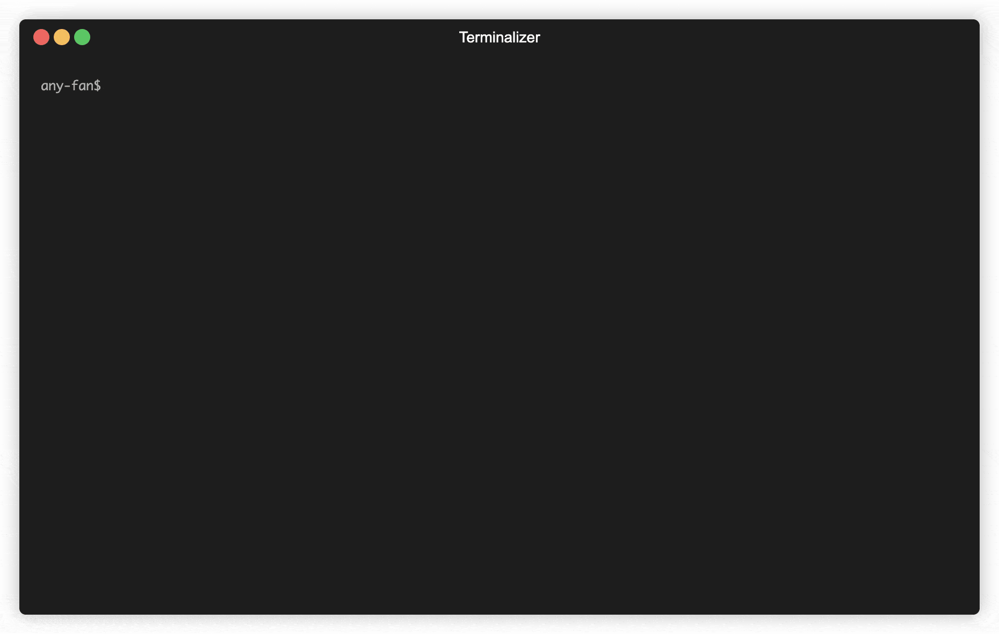

# Any-Sync Network
Configuration builder for Any-Sync nodes.

## Installation
You can download the binary release here: https://github.com/anyproto/any-sync-tools/releases  

#### Build from source   
```
go install github.com/anyproto/any-sync-tools/any-sync-network@latest
```

## Usage
```
any-sync-network create
```
Use the interactive CLI to describe the parameters of basic nodes and create additional nodes if needed. 

Note that there are prerequisites for successful configuration:
1. `consensus-node` requires MongoDB.
2. `file-node` requires an S3-compatible object storage and Redis.

You can use the generated `*.yml` files as your nodes' and `anytype-heart`'s configurations.

One can also use the CLI in a non interactive way by generating a default configuration using the defaults
flag. This is useful for automating configuration generation.
```
any-sync-network create --defaults
```

### Example


Configuring a network with three sync nodes and one file node.


## Contribution
Thank you for your desire to develop Anytype together!

❤️ This project and everyone involved in it is governed by the [Code of Conduct](https://github.com/anyproto/.github/blob/main/docs/CODE_OF_CONDUCT.md).

🧑‍💻 Check out our [contributing guide](https://github.com/anyproto/.github/blob/main/docs/CONTRIBUTING.md) to learn about asking questions, creating issues, or submitting pull requests.

🫢 For security findings, please email [security@anytype.io](mailto:security@anytype.io) and refer to our [security guide](https://github.com/anyproto/.github/blob/main/docs/SECURITY.md) for more information.

🤝 Follow us on [Github](https://github.com/anyproto) and join the [Contributors Community](https://github.com/orgs/anyproto/discussions).

---
Made by Any — a Swiss association 🇨🇭

Licensed under [MIT License](../LICENSE).